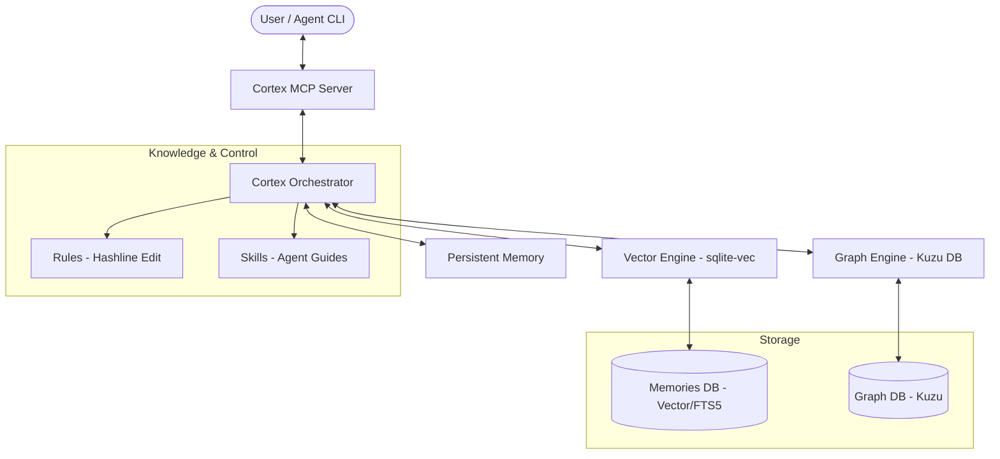

# 🌌 Cortex Agent Infrastructure (`.agents`)

**"The Bridge between Human Intent and Agent Intelligence."**

Cortex는 파편화된 에이전트의 기억을 영속화하고, 어떤 프로젝트에서든 즉시 작업 맥락을 형성할 수 있도록 설계된 **범용 에이전트 엔지니어링 인프라**입니다. 본 프로젝트는 최신 멀티 에이전트 오케스트레이션 패턴과 하이브리드 데이터베이스 기술을 결합하여 강력한 컨텍스트 엔진을 제공합니다.

---

## 🏗 시스템 아키텍처 (Architecture)

Cortex는 MCP(Model Context Protocol)를 통해 에이전트와 소통하며, 백그라운드에서 하이브리드 검색 엔진을 구동합니다.



---

## 📂 디렉토리 구조 (Directory Structure)

```
.agents/
├── data/           # [비공유] 상태 및 하이브리드 DB
│   ├── graph.kuzu/         # Kuzu DB 기반 코드 의존성 그래프
│   └── memories.db         # 하이브리드 핵심 DB (Vector + FTS5)
├── docs/           # [비공유] 인프라 관련 문서 (구조만 공유)
├── history/        # [비공유] 세션별 작업 이력 및 관찰 기록
├── hooks/          # 깃 훅 또는 시스템 훅 스크립트
├── rules/          # 에이전트 행동 규칙 및 정밀 편집 지침
├── scripts/        # MCP 서버 및 릴레이 관리 스크립트
├── skills/         # [비공유] 에이전트 전용 스킬 가이드
├── tasks/          # 에이전트 작업 관련 마크다운 문서
├── templates/      # 시스템 템플릿 파일
├── knowledge/      # 외부 지식 라이브러리
├── venv/           # [비공유] 파이썬 가상 환경
├── .env            # [비공유] 환경 변수
└── settings.yaml   # 인프라 전역 설정
```

## 🚀 주요 특징 (Key Features)

### 1. Hybrid Context Engine (Vector + Graph + RDB)
*   **Vector Search (`sqlite-vec`)**: 시맨틱 검색을 통해 관련 지식과 코드를 수초 내에 복원합니다.
*   **Graph Analysis (`Kuzu DB`)**: Cypher 쿼리를 사용해 코드 간의 복잡한 호출 관계 및 의존성을 정밀 분석합니다.
*   **FTS5 Text Search**: 키워드 기반의 고속 텍스트 검색을 지원합니다.

### 2. Multi-Lane Parallel Execution
단일 전역 Lock의 한계를 넘어, **도메인(Lane) 기반의 병렬 락 시스템**을 지원합니다. 여러 터미널에서 동시에 작업하더라도 각자 할당된 레인(예: `frontend`, `backend`)에서 충돌 없이 작업할 수 있습니다.

### 3. Precision Editing (Hashline Style)
줄 번호의 어긋남으로 인한 코드 훼손을 방지하기 위해, **내용 기반 치환(Content-based Replacement)** 방식을 강제합니다.

### 4. Lean Context Optimization
`.geminiignore` 등을 통해 에이전트의 불필요한 파일 스캔은 차단하면서도, **Cortex MCP 엔진**을 통해 DB에 저장된 정제된 정보만 에이전트에게 전달하여 토큰 효율을 극대화합니다.

---

## 🛠 설치 및 사용 (Installation)

- **상세 가이드**: [INSTALL.md](./INSTALL.md)
- **핵심 커맨드**:
  - `/로드`: Google Drive에서 .agents 폴더 가져오기
  - `/백업`: 현재 .agents 폴더를 Google Drive에 백업
  - `/지식화`: 주요 결정 사항 및 성공 패턴 영구 저장
  - `python3 .agents/scripts/relay.py status`: 현재 릴레이 상태 확인

---

## ⚖️ 라이선스 (License)
- **Code**: [MIT License](LICENSE)
- **Knowledge Base (vendor)**: 외부 지식 라이브러리의 원본은 [antigravity-awesome-skills](https://github.com/sickn33/antigravity-awesome-skills)이며 [CC BY 4.0](https://creativecommons.org/licenses/by/4.0/) 라이선스를 따릅니다.
